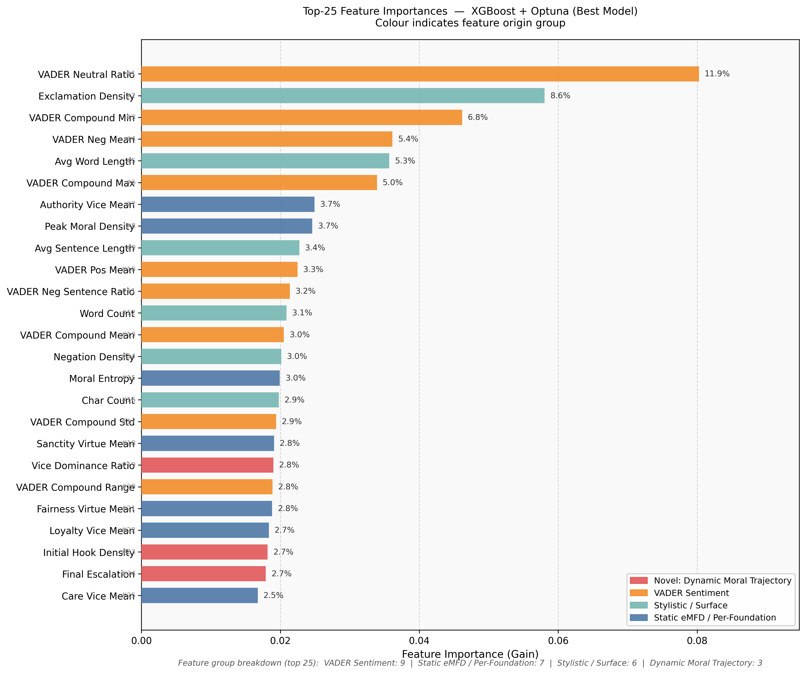
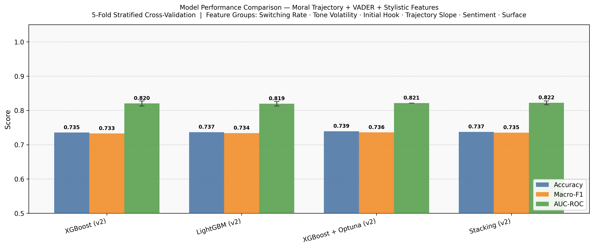

# Moral Hijacking Detector
### Dynamic Moral Trajectory for Emotional Manipulation Detection using Moral Foundation Theory

> **Published at:** ICIMTech 2026: International Conference on Information Management and Technology  
> **Institution:** School of Computer Science, Bina Nusantara University, Jakarta, Indonesia

---

## Overview

The **Moral Hijacking Detector** is an AI-powered NLP framework that detects emotionally manipulative text by modeling how moral framing **dynamically shifts across sentences**, not just what moral content is present.

Unlike prior work that relies on static document-level moral scores, this research introduces **Dynamic Moral Trajectory Engineering**: a novel feature set that captures intra-document moral dynamics such as switching rate, tone volatility, instability index, and escalation patterns, validated as statistically significant signals of manipulation (p < 0.001).

---

## Key Novelty

> *"We don't just ask WHAT is said morally. We ask HOW moral framing MOVES across every single sentence."*

9 novel dynamic moral trajectory features:

| Feature | Description |
|---|---|
| `tone_volatility` | Fluctuation in moral intensity across sentences |
| `switching_rate` | Frequency of dominant moral frame changes |
| `instability_index` | Combined volatility × switching rate |
| `initial_hook_density` | Moral strength in the opening sentences |
| `final_escalation` | Moral strength in the closing sentences |
| `escalation_delta` | Net change from opening to closing |
| `trajectory_slope` | Linear trend of moral intensity (OLS regression) |
| `vice_dominance_ratio` | Proportion of sentences where vice > virtue |
| `vice_virtue_ratio_volatility` | Instability of vice/virtue balance |

---

## Dataset

This project uses two publicly available datasets:

| Dataset | Source | Label |
|---|---|---|
| [Tweet Emotions](https://www.kaggle.com/datasets/pashupatigupta/emotion-detection-from-text) | Twitter / Kaggle | emotional = 1, neutral = 0 |
| [Propaganda Dataset](https://www.kaggle.com/datasets/mahdimashayekhi/propaganda-detection) | SemEval / NLP4IF | propaganda = 1, non-propaganda = 0 |

After merging and class balancing (undersampling ratio 1.1) → **30,376 training samples**

> Datasets are not included in this repository due to size and licensing. Please download them from the links above and place them in the `data/` folder.

---

## Pipeline

```
Tweet Emotions + Propaganda Dataset
        ↓
  Merge & Label (1=manipulative, 0=neutral)
        ↓
  Class Balancing: undersampling (ratio 1.1)
        ↓
  Sentence Segmentation (spaCy, >20 chars)
        ↓
  eMFD Moral Scoring (10-dim vector per sentence)
  5 foundations × vice + virtue
        ↓
  Dynamic Moral Trajectory Engineering (28 features)
        ↓
  VADER Sentiment (10 features) + Stylistic/Surface (10 features)
        ↓
  Feature Matrix fd (~47 combined features)
        ↓
  4 Models: XGBoost · LightGBM · XGBoost+Optuna · Stacking Ensemble
        ↓
  5-fold Stratified Cross-Validation
  Metrics: Accuracy · Macro-F1 · AUC-ROC
```

---

## Results

### Model Performance

| Model | Accuracy | Macro-F1 | AUC-ROC |
|---|---|---|---|
| XGBoost (manual) | 0.735 | 0.733 | 0.820 |
| LightGBM (manual) | 0.737 | 0.734 | 0.819 |
| **XGBoost + Optuna** | **0.739** | **0.736** | **0.821** |
| Stacking Ensemble | 0.737 | 0.735 | 0.822 |

### Spearman Correlation: Novel Features

| Feature | ρ | p-value |
|---|---|---|
| Tone Volatility | +0.1713 | < 0.001 |
| Instability Index | +0.1710 | < 0.001 |
| Vice/Virtue Ratio Volatility | +0.1696 | < 0.001 |
| Switching Rate | +0.1593 | < 0.001 |
| Avg Word Length | −0.2219 | < 0.001 |

All dynamic moral trajectory features show statistically significant correlations with the manipulation label (p < 0.001), confirming the statistical viability of the proposed novelty.

### Feature Importance (Top 25: XGBoost + Optuna)


### Model Comparison


---

## Installation & Usage

### Requirements

```bash
pip install pandas numpy scikit-learn xgboost lightgbm optuna
pip install spacy vaderSentiment textstat
pip install https://github.com/medianeuroscience/emfdscore/archive/master.zip
python -m spacy download en_core_web_sm
```

### Run

1. Clone this repository
```bash
git clone https://github.com/<your-username>/moral-hijacking-detector.git
cd moral-hijacking-detector
```

2. Download datasets from Kaggle and place in `data/` folder:
```
data/
├── tweet_emotions.csv
└── propaganda_dataset.csv
```

3. Open and run the notebook
```bash
jupyter notebook scopus_final.ipynb
```

---

## Repository Structure

```
moral-hijacking-detector/
├── README.md
├── scopus_final.ipynb        # Main notebook
├── scopus_paper_final.pdf    # Full research paper (ICIMTech 2026)
├── assets/
│   ├── feature_importance_v2.png
│   └── model_comparison_v2.png
└── data/
    └── README_data.md        # Dataset download instructions
```

---

## Authors

| Name | Email |
|---|---|
| Joshua Joyson Kustiadi | joshua.kustiadi@binus.ac.id |
| Kelly Roselin Wijaya | kelly.wijaya002@binus.ac.id |
| Raynaldo Winson Amadeus Kusuma | raynaldo.kusuma@binus.ac.id |
| Kristien Margi | kristien.margi@binus.ac.id |
| Ricky Reynardo Siswanto | ricky.siswanto@binus.ac.id |

**School of Computer Science, Bina Nusantara University, Jakarta, Indonesia**

---

## Citation

If you use this work, please cite:

```
Kustiadi, J. J., Wijaya, K. R., Kusuma, R. W. A., Margi, K., & Siswanto, R. R. (2026).
Dynamic Moral Trajectory for Emotional Manipulation Detection using Moral Foundation Theory.
ICIMTech 2026: International Conference on Information Management and Technology.
Bina Nusantara University, Jakarta, Indonesia.
```

---

## Keywords

`Emotional Manipulation Detection` · `Dynamic Moral Trajectory` · `Moral Foundation Theory` · `NLP` · `XGBoost` · `LightGBM` · `Stacking Ensemble` · `Explainable AI` · `Computational Social Science` · `Propaganda Detection`
